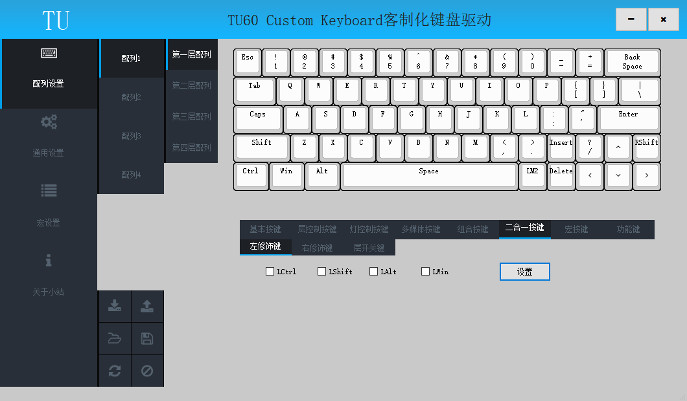
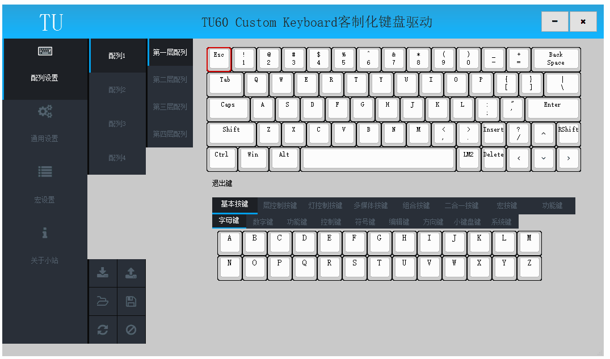

# 二合一键

此节内容相关操作均在驱动的配列设置页面；

## 含义

二合一键可以通过短按或长按等不同操作输出不同的按键；

	短按（按下按键300ms以内释放）输出基本按键;
	长按（按下按键300ms以内不释放）输出修饰按键或切层按键;
	组合（按下按键后按其他按键）输出修饰按键或切层按键;
	先短按后长按（按下按键300ms以内释放，释放300ms以内再次按下不释放）一直输出基本按键;

例如

	将某个按键设置为空格键和切层键LM2二合一;
	短按（按下按键300ms以内释放）输出空格;
	长按（按下按键300ms以内不释放）实现切层功能，与LM2键功能相同;
	组合（按下按键后按其他按键）实现切层功能，与LM2键功能相同;
	先短按后长按（按下按键300ms以内释放，释放300ms以内再次按下不释放）一直输出空格;

## 设置二合一键

	在键盘面板上点击待设置按键，按键框线变为红色指示当前配置按键；
	在按键选择区域点击设置的普通按键，键盘面板上当前按键显示选择的普通按键；
	在按键选择区域的二合一按键下勾选设置的修饰按键，点击"设置"按钮(或点击二合一按键下的切层键)，键盘面板上当前按键显示变为斜体，键盘面板指示栏显示修饰键或切层键；
	写入配列，完成二合一键设置；

	

