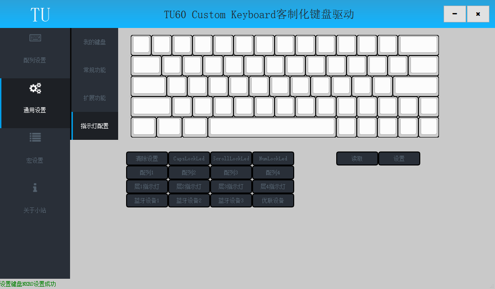

# 指示灯

此节内容相关操作均在驱动的通用设置—>指示灯配置页面

## 指示灯含义

悬停鼠标显示绿色框线的轴灯为可配置轴灯，可以自定义为以下任意指示灯；
	
|指示灯设置|指示灯含义|
| ------ | ------ |
| 清除设置 | 轴灯效果跟随键盘背光灯 |
| CapsLockLed | 轴灯为大写锁定指示灯 |
| ScrollLockLed | 轴灯为滚动锁定指示灯 |
| NumLockLed | 轴灯为数字键盘锁定指示灯 |
| 配列1 | 轴灯亮，表示当前使用配列为配列1 |
| 配列2 | 轴灯亮，表示当前使用配列为配列2 |
| 配列3 | 轴灯亮，表示当前使用配列为配列3 |
| 配列4 | 轴灯亮，表示当前使用配列为配列4 |
| 层1指示灯 | 轴灯亮，表示当前使用层为1层 |
| 层2指示灯 | 轴灯亮，表示当前使用层为2层 |
| 层3指示灯 | 轴灯亮，表示当前使用层为3层 |
| 层4指示灯 | 轴灯亮，表示当前使用层为4层 |
| 蓝牙设备1 | 轴灯为蓝牙设备1状态指示灯 |
| 蓝牙设备2 | 轴灯为蓝牙设备2状态指示灯 |
| 蓝牙设备3 | 轴灯为蓝牙设备3状态指示灯 |
| 优联设备 | 轴灯为优联设备状态指示灯 |

## 写入指示灯配置

在键盘面板上点击待配置轴灯，框线变为红色指示当前选择轴灯；
点击相应的指示灯配置按钮，点击“设置”按钮写入指示灯配置；
设置成功后状态栏弹出设置成功提示；

## 读取指示灯配置

点击“读取”按钮读取指示灯配置；
读取成功后状态栏弹出读取成功提示；

