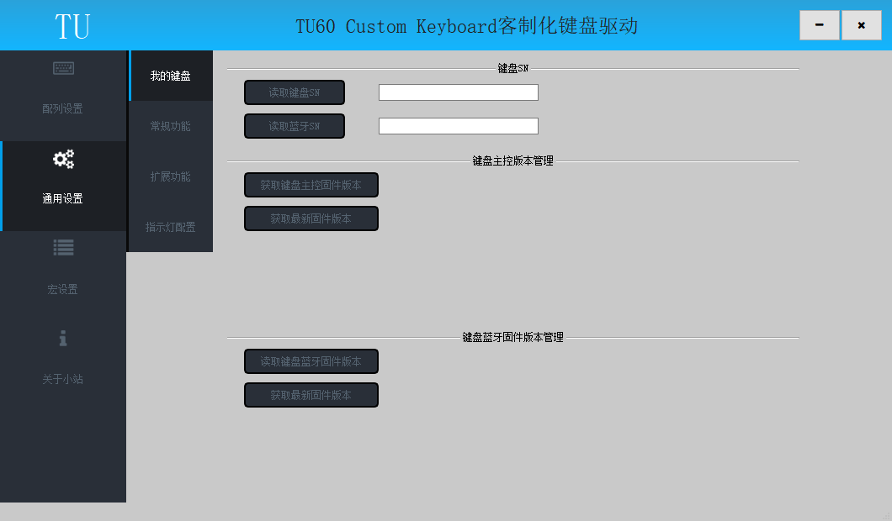
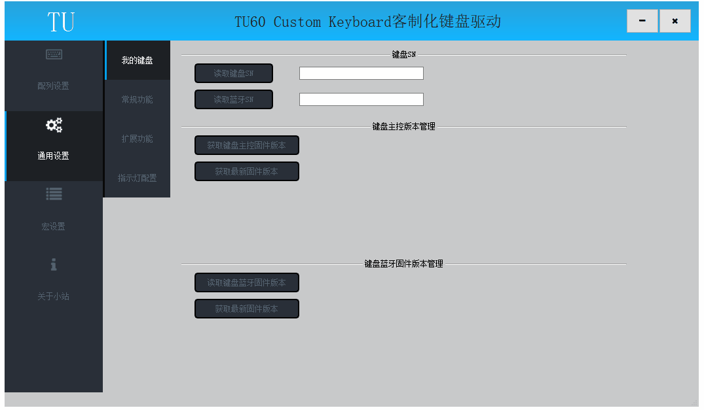
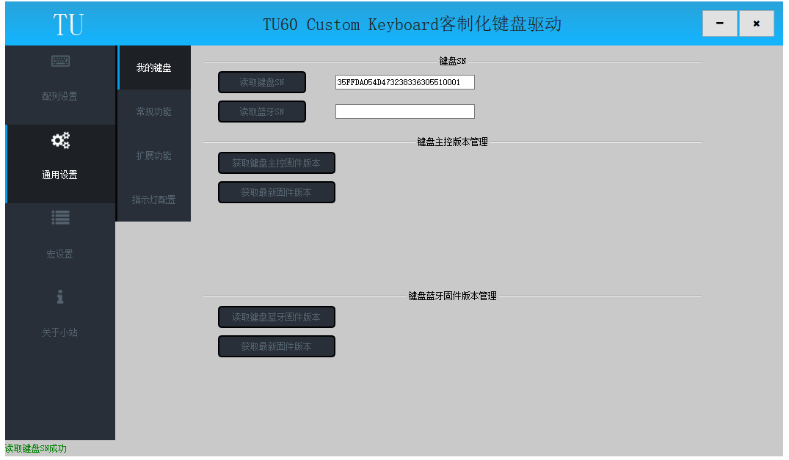

# 版本管理

此节内容相关操作均在驱动的通用设置—>我的键盘页面

## 键盘SN

键盘出厂序列号，点击"读取键盘SN"按钮可以查询;

读取成功后显示键盘SN，驱动左下角提示读取成功；

## 主控版本

点击"获取键盘主控固件版本"按钮可以查询当前键盘固件版本;

点击"获取最新固件版本"按钮可以查询当前服务器最新固件版本和新版本更新内容;

如果服务器最新固件版本大于当前键盘固件版本，可以自行选择是否升级，升级操作查看[主控升级](./升级/主控升级.md)章节；

## 蓝牙版本

仅限支持蓝牙套件操作

