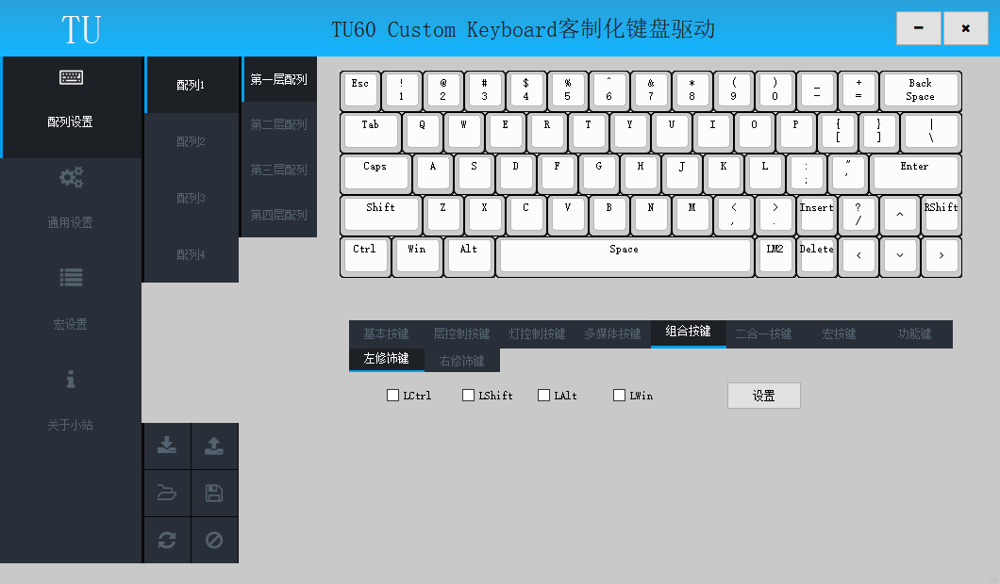

# 组合键

此节内容相关操作均在驱动的配列设置页面；

## 含义

组合键可以实现触发一个按键同时输入一个普通按键和多个修饰按键；

例如

	将某个按键设置为数字键1和修饰键Shift组合，可以一个按键实现输入叹号;
	将某个按键设置为编辑键Del和修饰键Ctrl&Alt组合，可以一个按键实现热启动;

## 设置组合键

	在键盘面板上点击待设置按键，按键框线变为红色指示当前配置按键；
	在按键选择区域点击设置的普通按键，键盘面板上当前按键显示选择的普通按键；
	在按键选择区域的组合按键下勾选设置的修饰按键，点击"设置"按钮，键盘面板上当前按键显示变为斜体，键盘面板指示栏显示修饰键；
	写入配列，完成组合键设置；

	

