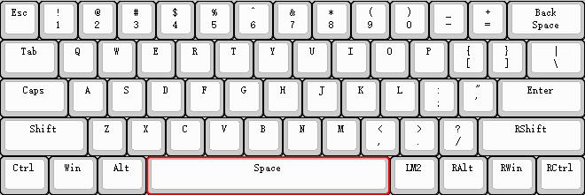
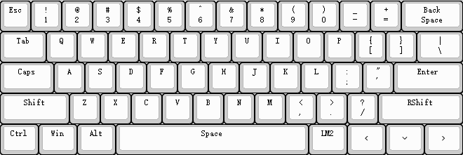
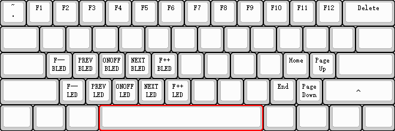

# 布局和层

## 布局（Layout)
键盘的各个按键输出不同的键值，布局是对全部按键输出键值的整体描述；
客制化键盘相较于量产键盘的最大优势就是可以自定义每个按键的键值，用户可以按照自己的喜好自定义每个按键，最终形成的整体键值图称为布局；
下图为最常用的qwerty布局。

下图为dvorak布局，相比于qwerty布局，将高频键分布在中排，降低手指移动距离，均衡左右手负担。

## 层（LAYER）

对于非全尺寸键盘（特别是40%和60%），需要用更少的按键去实现全部按键的功能；客制化键盘引入层的概念，便将全部按键分多层放置，同时设立层切换按键，这样便可实现全部按键的输出；

下图为60%的第一层按键

下图为60%的第二层按键

将常用的60个按键放置在第一层，将不常用的按键（如F1-F12）放在第二层，同时在第一层设置一个按键（LM2）用于切换到第二层，这样如果需要输出第一层按键（如数字1）直接单击即可，需要输出第二层按键（如功能F1），需要使用LM2和按键组合操作输出；

## 

根据用户

