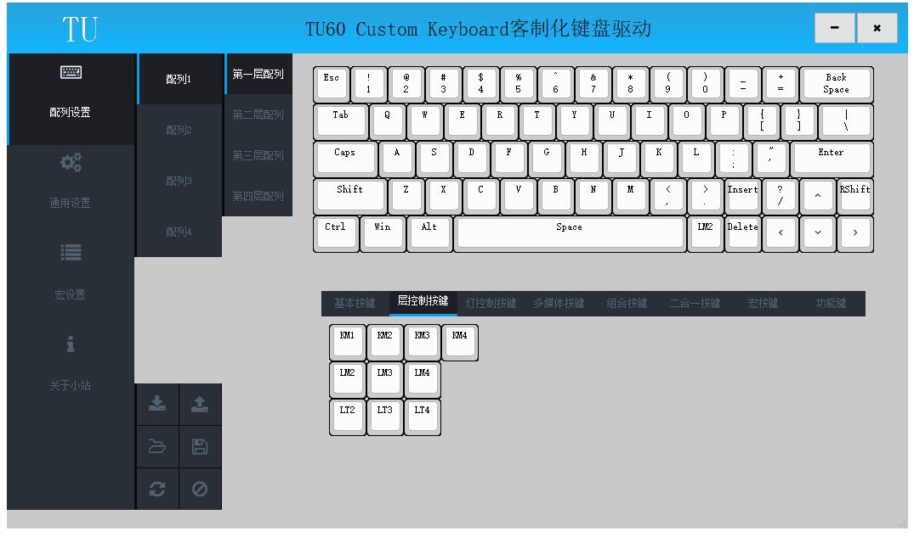
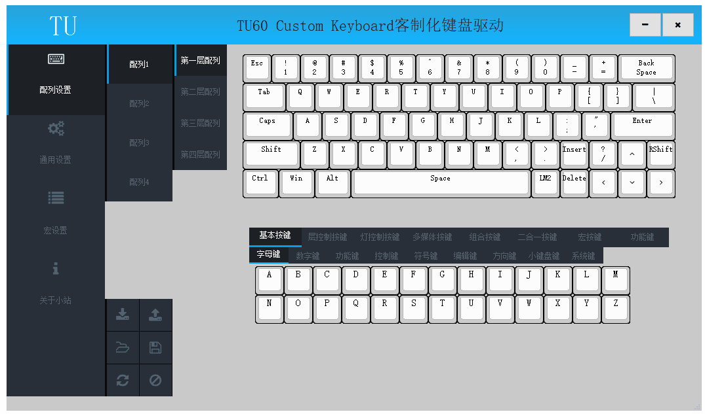

# 配列操作

此节内容相关操作在驱动的配列设置页面；

## 含义

键盘全键可自定义，用户可以根据自己的习惯喜好设置任意按键，提高输入效率；

## 键值分类

在按键选择区域，根据按键类别分为多个大类，将鼠标悬停在按键上可以弹出按键含义提示；

##### 基本按键

该类别按键为基本键盘按键；

|按键小类|按键含义|
| ------ | ------ |
| 字母键 | 字母A到Z |
| 数字键 | 数字0到9 |
| 功能键 | F1到F12 |
| 控制键 | 回车、退格、空格、跳格等及修饰键 |
| 符号键 | 逗号、句号等标点符号 |
| 编辑键 | Insert、Delete、Home、End、PgUp、PgDown |
| 方向键 | 方向上、下、左、右 |
| 小键盘键 | 小键盘区数字、运算符及NumLock |
| 系统键 | PrintScreen、ScrollLock、PauseBreak |

##### 层控制按键

该类别按键为配列及层控制按键，具体参考[配列和层](配列和层.md)小节

|按键名称|按键含义|
| ------ | ------ |
| KM1 | 单击切换到配列1 |
| KM2 | 单击切换到配列2 |
| KM3 | 单击切换到配列3 |
| KM4 | 单击切换到配列4 |
| LM2 | 按键按下开启层2,按键释放关闭层2 |
| LM3 | 按键按下开启层3,按键释放关闭层3 |
| LM4 | 按键按下开启层4,按键释放关闭层4 |
| LT2 | 单击开关层2 |
| LT3 | 单击开关层3 |
| LT4 | 单击开关层4 |

##### 背光灯控制按键

该类别按键为背光灯控制按键，具体参考[背光灯](背光灯.md)小节

##### 底灯控制按键

该类别按键为底灯控制按键。

|按键名称|按键含义|
| ------ | ------ |
| ONOFFBLED | 单击控制底灯开启或关闭 |
| NEXTBLED |  单击控制底灯为下一灯效 |
| PREVBLED | 单击控制底灯为上一灯效 |
| F++BLED | 单击加快底灯呼吸速率或提高底灯亮度 |
| F--BLED | 单击减慢底灯呼吸速率或降低底灯亮度 |
| H++BLED | 单击增加RGB底灯色相 |
| H--BLED | 单击减少RGB底灯色相 |
| S++BLED | 单击增加RGB底灯饱和度 |
| S--BLED | 单击减少RGB底灯饱和度 |
| B++BLED | 单击增加RGB底灯亮度 |
| B--BLED | 单击减少RGB底灯亮度 |

##### 多媒体按键

该类别按键为多媒体控制按键，可以控制音频视频播放、网页浏览及快速开启常用程序；

|按键图标|按键含义|
| ------ | ------ |
|  | 静音 |
|   | 音量提高 |
|  | 音量降低 |
|  | 下一曲 |
|  | 上一曲 |
|  | 停止 |
|  | 播放\暂停 |
|  | 播放器 |
|  | 邮件 |
|  | 计算器 |
|  | 我的电脑 |
|  | 搜索 |
|  | 浏览器主页 |
|  | 浏览器后退 |
|  | 浏览器前进 |
|  | 浏览器停止 |
|  | 浏览器刷新 |
|  | 浏览器收藏夹 |

##### 组合按键

具体参考[组合键](组合键.md)小节

##### 二合一键

具体参考[二合一键](二合一键.md)小节

##### 宏按键

具体参考[宏键](宏键.md)小节

##### 功能键

该类别按键用于操作无线模块，具体参考[无线](../无线/无线.md)小节

## 修改键值

	该功能用于修改单个按键的键值;
	点击配列选择区选择待操作的配列;
	点击层选择区选择待操作的层;
	在键盘面板区点击待修改的按键,选中的按键出现红色框线;
	在按键选择区选择修改后的键值完成修改键值操作;

以下示例演示修改键值操作；

## 写入配列

	该功能将当前配列写入键盘;
	在键盘面板上点击待设置按键，按键框线变为红色指示当前配置按键;
	在按键选择区域点击要设置成的按键，键盘面板上当前按键显示为设置的按键;
	点击写入配列按钮,完成按键的修改和写入，同时状态栏显示写入成功与否；
	写入配列按键只会写入当前配列，不会同时修改4个配列;

以下示例演示将配列1的第二排按键设置为ABCD后写入，将配列2的第一排按键设置为ABCD后写入；

## 读取配列
	该功能用于读取键盘内部存储的配列;
	点击读取配列按钮,状态栏显示读取成功与否；如读取成功，键盘面板将显示键盘内部存储的配列;
	读取配列按键只会读取当前配列，不会同时读取4个配列;

以下示例演示分别读取键盘内部存储的配列1和配列2；

## 保存配列

	该功能用于将当前配列保存为本地文件;
	点击保存配列按钮,弹出保存文件对话框，输入文件名点击保存后,状态栏显示保存成功;
	保存配列只会保存当前配列，不会同时保存4个配列;

以下示例演示将当前配列保存为本地文件；

## 加载配列

	该功能用于从本地文件读取配列;
	点击加载配列按钮,弹出打开文件对话框，选择配列文件后点击读取,状态栏显示读取成功;
	加载配列只会更改当前配列，不会同时更改4个配列;

以下示例演示从本地文件加载配列；

## 恢复默认配列

	该功能用于将当前配列恢复为默认配列;
	点击恢复默认按钮,当前配列将恢复为默认配列;
	恢复默认只会恢复当前配列，不会同时恢复4个配列;

以下示例演示恢复默认配列；

## 设置键值为空

	该功能用于将单个按键设置为空按键;
	选中待操作的按键,然后点击设置为空按钮,当前选中按键将会被设置为空按键;

以下示例演示设置按键为空；

