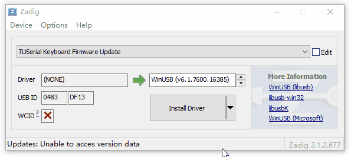

# 主控升级

## 系统要求

	Windows 64位Win7、Win8、Win8.1、Win10
	Windows 32位暂不可用

## 下载升级工具

[【TU40升级工具V1.5】](https://tuusermanual.oss-cn-beijing.aliyuncs.com/UpdateTool/TU40_KeyboardUpdateToolSetup_1_5.exe)

[【TU60升级工具V1.5】](https://tuusermanual.oss-cn-beijing.aliyuncs.com/UpdateTool/TU60_KeyboardUpdateToolSetup_1_5.exe)

安装完成后桌面有如下两个快捷方式 

	ReflashTool为固件刷写工具
	UpdateTool为固件下载工具

## 下载驱动替换工具

[【zadig】](https://tuusermanual.oss-cn-beijing.aliyuncs.com/Tool/zadig_2.1.2.exe)

## 进入升级模式

	【有线版本键盘】
	   	拔掉键盘数据线
		按住键盘默认配列的T键和U键
		插入键盘数据线
		释放T键和U键
	
	【无线版本键盘方法1】
		拔掉键盘数据线
		移除键盘电池
		保持主板开关开启
		按住键盘默认配列的T键和U键
		插入键盘数据线
		释放T键和U键
	
	【无线版本键盘方法2】
		拔掉键盘数据线
		关闭主板开关
		按住键盘默认配列的T键和U键
		开启主板开关
		释放T键和U键
		插入键盘数据线

进入升级模式后，键盘背光整体闪烁，识别到名为"TuSerial Keyboard Firmware Update"的新设备

## 替换USB驱动

	打开zadig软件，点击Options->List All Devices
	选择设备TUSerial Keyboard Firmware Update，点击Install Driver。
		安装驱动前确保Driver后面左侧为（NONE），右侧为WinUSB
		若左侧已经为WinUSB，说明驱动已经替换过，跳过替换驱动步骤即可
	驱动替换成功后，弹出成功提示，关闭zadig软件

## 下载固件

	打开固件下载工具，点击获取固件信息按钮，查询服务器最新固件信息
	点击下载固件，等待固件下载完毕后弹出下载成功对话框

## 刷写固件

	打开固件刷写工具,将自动刷写固件，刷写完毕后弹出刷写成功提示

## 退出升级模式

	【有线版本键盘】
	   	拔掉键盘数据线
		重新插入键盘数据线
	
	【无线版本键盘方法1】
		拔掉键盘数据线
		关闭主板开关
		安装电池
		开启主板开关
	
	【无线版本键盘方法2】
		拔掉键盘数据线
		关闭主板开关
		开启主板开关

至此，完成全部主控固件升级。

