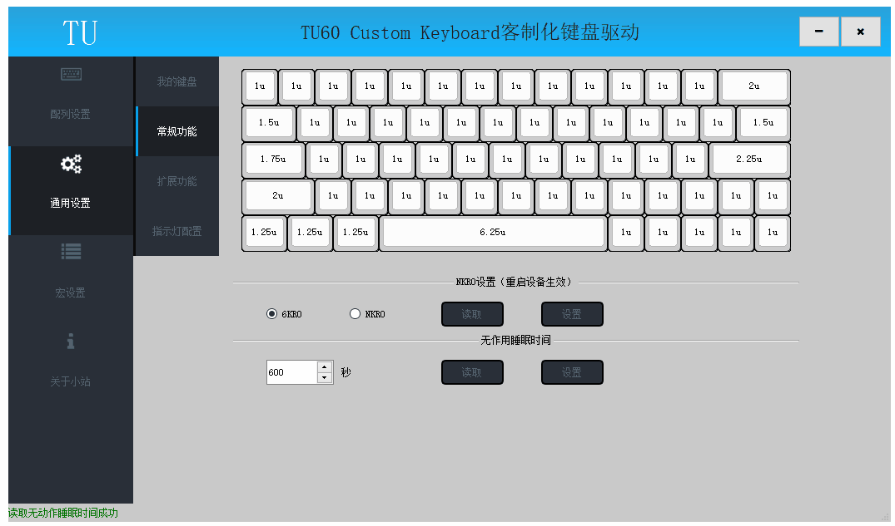
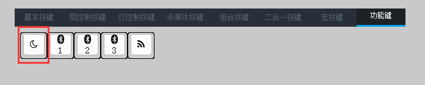

# 睡眠

此节内容相关操作均在驱动的通用设置->常规功能页面；

## 自动睡眠

为了降低键盘功耗，无线版本键盘具有自动睡眠功能，在一定时间内(下称“无动作睡眠时间”)无按键操作，设备将自动进入睡眠状态；	
无动作睡眠时间可以通过驱动设置，设置过大将浪费键盘电量,减少使用时间;设置过小将频繁进入睡眠，影响使用体验；

####  读取无动作睡眠时间
点击无动作睡眠时间下的"读取"按钮可以查询当前键盘无动作睡眠时间；
读取成功后状态栏弹出读取成功提示；

#### 设置无动作睡眠时间

手动修改无动作睡眠时间，默认为180s，点击“设置”按钮写入键盘；
设置成功后状态栏弹出设置成功提示；

## 手动睡眠
TU客制化键盘提供手动休眠按键，单击休眠按键可以立即进入睡眠状态；
该按键在功能键分类下；

## 睡眠唤醒
进入睡眠的键盘，可以按最左上按键(默认配列ESC按键)唤醒键盘,也可以插入有线进入有线模式；

