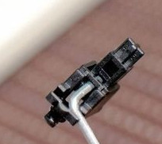
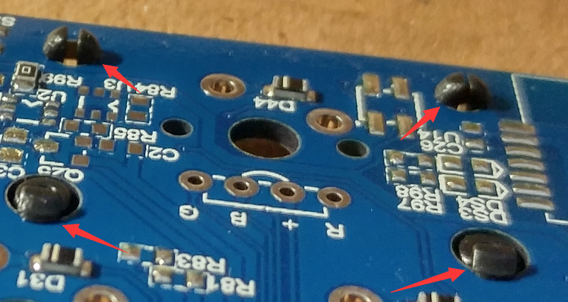
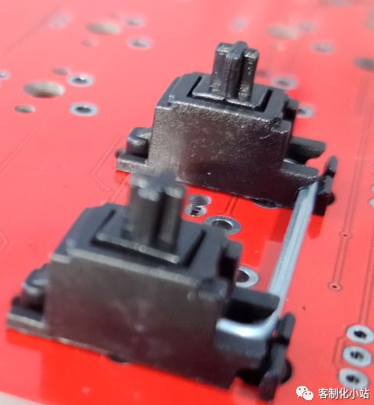
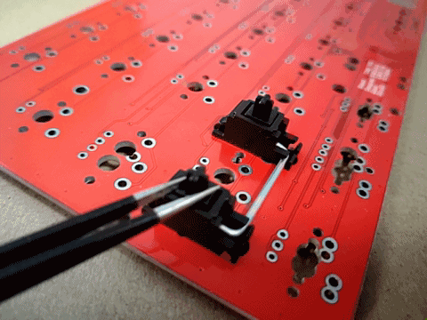
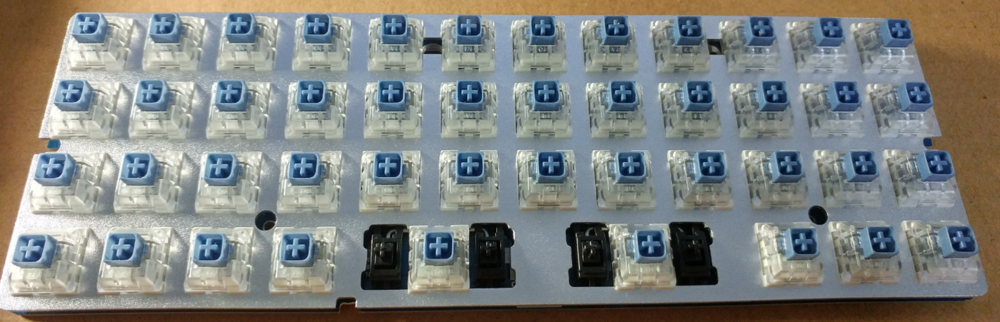
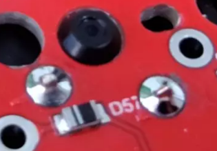
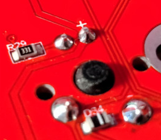
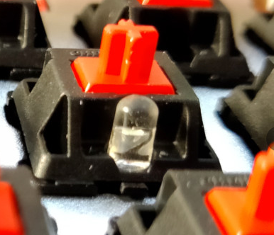

# 装配

此装配步骤只保证适用于本店所售TU40及TU60套件；

## 准备硬件

|硬件名称| 数量 | 说明 |
| ------ | ------ | ------ |
| 主板 | 1张 |  |
| 底壳 | 1个 |  |
| 定位板 | 1张 | 无钢版本无需准备 |
| 轴体 | N个 | 使用数量取决于键盘|
| 卫星轴 | 1套 | TU套件使用PCB卫星轴 |
| 键帽 | 1套 | |
| LED灯 | N个 | 不装灯无需准备 |
| 防滑脚贴 | 4个 | |
| 螺丝 | 若干 | |
| 电池 | 1个 | 无线版本使用 |
| 双面胶 | 1个 | 无线版本使用 |

## 准备工具

|硬件名称| 数量 | 说明 |
| ------ | ------ | ------ |
| 烙铁 | 1个 | 用于焊接 |
| 焊锡丝 | 若干 | 用于焊接 |
| 吸锡器 | 1个 | 用于装配错误时解焊 |
| 螺丝刀 | 1个 | 适配M2十字螺丝|
| 斜口钳 | 1个 | 用于剪灯脚 |

## 装配顺序

如果选用的轴不支持直插灯，如Box轴、TTC轴，需要使用234方灯，按照先安装灯再安装轴的顺序装配；

如果选用的轴支持直插灯，如樱桃轴、佳达隆轴，使用3mm无边灯，按照先安装轴再安装灯的顺序装配；

此教程使用樱桃轴演示，采用先安装轴再安装灯的顺序；

## 组装卫星轴
*此部分图片取于百度经验

PCB卫星轴由三部分组成:钢丝、假轴和轴芯，如下图，图中从上至下依次为假轴、轴芯、钢丝。

轴芯分为前后两侧，后侧只有一个洞口（下图左），前侧有上下两个洞口（下图右）。

将轴芯插入假轴中，轴芯的前侧（有上下两个洞口的一端）朝向钢丝的插入端，此处若插反将导致按键卡顿；

插入后如下图

将钢丝插入轴芯正面两个洞中下面的那个洞，然后将钢丝压入轴座的卡槽内

同样方式安装卫星轴另一侧，完成后如下图

同样方式组装剩余卫星轴
|布局 | 卫星轴数量 |
| ------ | ------ |
| 40常规 | 2X 两组 |
| 40普朗克 | 2X 两组 |
| 60 POKER | 6.25X 一组 2X 四组 |
| 64非左移 | 6.25X 一组 2X 三组 |
| 64左移 | 6.25X 一组 2X 三组 |

## 卫星轴安装
主板上共有4个孔洞用于安装卫星轴，两大两小；
将卫星轴钢丝侧的外伸脚插入偏大的孔洞中，背部伸出的倒钩应卡主主板背面

将卫星轴钢丝对侧的外伸脚插入偏小的孔洞中，背部伸出的侧沟应卡主主板背面

使用同样方式安装卫星轴的另一侧，安装完成的卫星轴底面应与主板紧密贴合

安装完成后，使用镊子拉起一侧轴芯，检查另一侧轴芯能否在钢丝作用下被动拉起；

## 安装定位板
*组无钢版本键盘跳过此步骤

将定位板防与主板重合放置，然后将主板四角的轴体和安装卫星轴的大键轴体插入，此处先不要焊接；

轴体插入后，主板与定位板并非紧密接触，二者之间存在一定的距离；
定位板被卡在轴体的倒三角豁口内，轴体底面与主板正面紧密接触；

必须保证轴体底面与主板正面紧密接触，否则会影响装配效果；

## 大键试装
试装安装卫星轴的大键键帽，反复敲打大键的中间和左右边缘位置，检查是否有卡顿或按键不回弹等问题。

如果存在问题，需重新安装卫星轴；

## 焊接轴体

烙铁使用方法请自行百度；

首先焊接四角的轴体，这样可以保证定位板固定；再依次插入其他轴体进行焊接；
	
	焊接过程中应对轴体施加一定下压力，确保轴体底部与主板正面紧密接触，否则会导致轴体虚焊、键盘不平整等问题；
	压入轴体前应检查轴脚已经进入轴孔再用力压入，歪斜的轴脚在用力压入过程中可能会刮伤主板正面线路；

焊锡丝应采用高品质焊锡丝，焊接完的焊点光亮、饱满，呈锥形；

## 焊接轴灯

*不安装轴灯可跳过此步骤

LED灯长脚为正极，短脚为负极；主板灯孔方孔位正极，圆孔为负极；主板背面正极标有正号，正负极反向将导致灯不亮；

将灯从轴上灯孔插入，灯脚分别穿过主板，使用烙铁焊接后剪断灯脚；
	
	不建议使用弯折灯脚的方式固定轴灯，弯折的灯脚不易解焊；
	剪灯脚是一定注意不要划伤主板或碰坏主板器件；

​	

灯珠应完全沉入轴上预留灯孔，过高的灯珠会导致按键无法回弹；

## 安装电池

*有线版本可跳过此步骤

安装电池一定要确认好固定位置再使用双面胶固定，电池的固定位置应避开主板背面的电池插座，建议靠底壳右侧固定电池；

选定固定位置后使用双面胶将电池与底壳固定，然后将电池接头插入主板电池插座；合理放置电池线，避免后续步骤被压损；

## 安装底壳

安装底壳前建议连接USB线对所有轴和灯进行测试，以免由于虚焊、漏焊造成返工；

将组好的内胆放入底壳中，使用螺丝固定主板和底壳即可；

## 安装脚贴

撕去脚贴有胶一侧的保护膜，贴到底壳背面的脚贴安装处；
再撕去脚贴另一侧保护膜；

## 安装键帽
将键帽按照配列依次插到对应轴体上即可；

