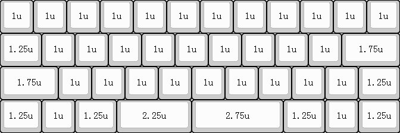
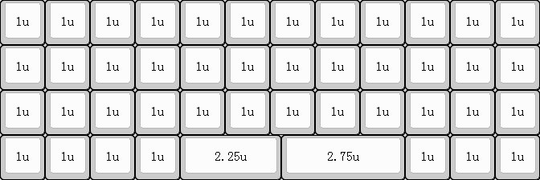
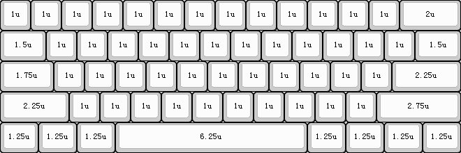
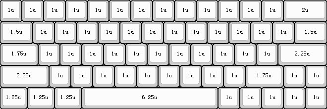
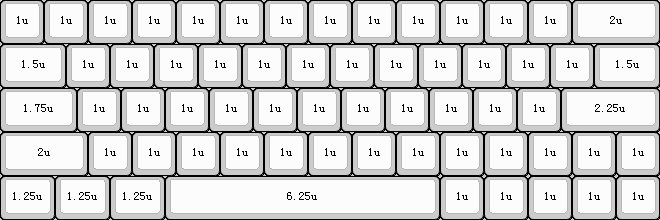
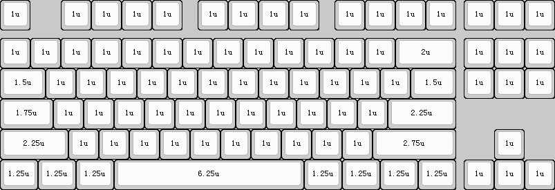
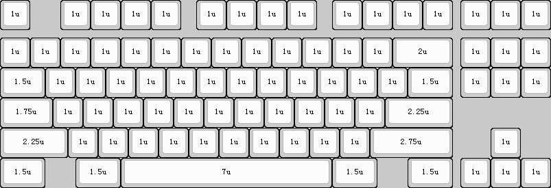
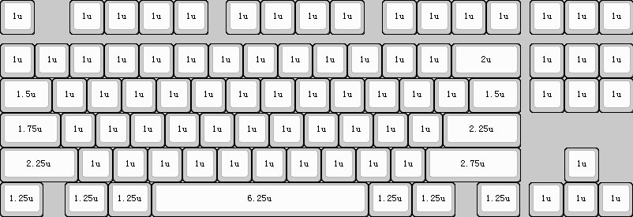

## 选择配列

- 根据自身偏好选择合适的尺寸及配列；
- 40%配列分为常规配列（42键）和普朗克配列（45键）；
- 60%配列分为Poker配列（61键）、64非左移配列（63键）和64左移配列（64键）；
- 80%配列分为无门牙配列（87键）、大门牙配列（84键）和小门牙配列（86键）；
- 60%及以下配列需要使用组合键输出部分按键；

#### 40常规配列

#### 40普朗克配列

#### 60Poker配列

#### 64非左移配列

#### 64左移配列

#### 87无门牙配列

#### 87大门牙配列

#### 87小门牙配列

