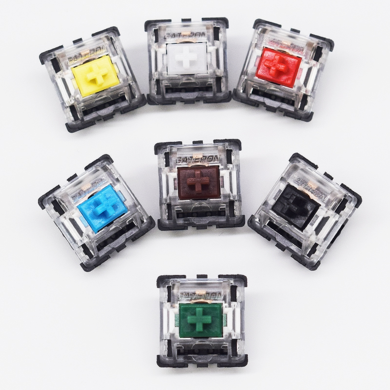

# 轴体

- 轴体对于一把键盘的手感起基础决定作用；

## 品牌
### Cherry MX轴

### 佳达隆KS8

### 正牌科电TTC

## 线性度

- 线性轴按动过程直上直， 非线性轴按动过程有段落感；

- 【樱桃MX】黑轴、红轴属于线性轴，茶轴、青轴属于非线性轴；

- 【佳达隆KS8】白轴、黄轴、红轴、黑轴属于线性轴，茶轴、青轴、绿轴属于非线性轴；

- 【TTC】TTC金粉轴属于线性轴；

## 触发键程
- 触发键程指下压按键时触发开关所需的最小距离；

## 压力克数
- 压力克数指在按下按键时所需要的力度；

## 固定脚数
- 五脚轴相比三脚轴多两个固定脚，防止轴歪；
- 定位板也具有防止轴歪的作用；
- 使用三脚轴，需要装配定位板，使用五脚轴，定位板可用可不用；

