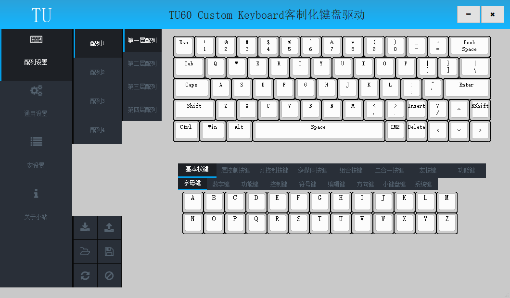
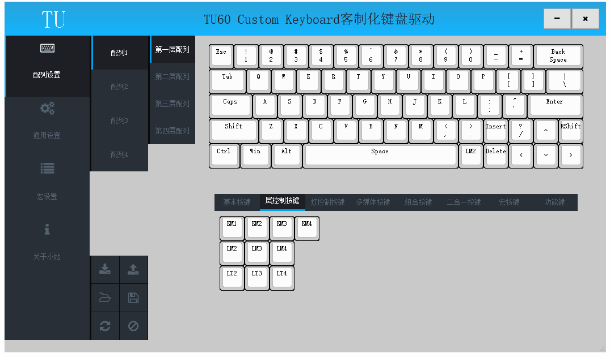

# 修改按键

此节内容相关操作在驱动的配列设置页面；

## 含义

键盘全键可自定义，用户可以根据自己的习惯喜好设置任意按键，提供输入效率；

## 按键分类

在按键选择区域，根据按键类别分为多个大类，将鼠标悬停在按键上可以弹出按键含义提示；

##### 基本按键

该类别按键为基本键盘按键；

|按键小类|按键含义|
| ------ | ------ |
| 字母键 | 字母A到Z |
| 数字键 | 数字0到9 |
| 功能键 | F1到F12 |
| 控制键 | 回车、退格、空格、跳格等及修饰键 |
| 符号键 | 逗号、句号等标点符号 |
| 编辑键 | Insert、Delete、Home、End、PgUp、PgDown |
| 方向键 | 方向上、下、左、右 |
| 小键盘键 | 小键盘区数字、运算符及NumLock |
| 系统键 | PrintScreen、ScrollLock、PauseBreak |

##### 层控制按键

该类别按键为配列及层控制按键，具体参考[配列和层](配列和层.md)小节

|按键小类|按键含义|
| ------ | ------ |
| KM1 | 单击切换到配列1 |
| KM2 | 单击切换到配列2 |
| KM3 | 单击切换到配列3 |
| KM4 | 单击切换到配列4 |
| LM2 | 按键按下开启层2,按键释放关闭层2 |
| LM3 | 按键按下开启层3,按键释放关闭层3 |
| LM4 | 按键按下开启层4,按键释放关闭层4 |
| LT2 | 单击开关层2 |
| LT3 | 单击开关层3 |
| LT4 | 单击开关层4 |

##### 背光灯控制按键

该类别按键为背光灯控制按键，具体参考[背光控制](背光控制.md)小节

|按键名称|按键含义|
| ------ | ------ |
| ONOFFLED | 单击控制背光灯开启或关闭 |
| NEXTLED |  单击控制背光灯为下一灯效 |
| PREVLED | 单击控制背光灯为上一灯效 |
| F++LED | 单击加快背光灯呼吸速率或提高背光灯亮度 |
| F--LED | 单击减慢背光灯呼吸速率或降低背光灯亮度 |
| H++LED | 单击增加RGB背光灯色相 |
| H--LED | 单击减少RGB背光灯色相 |
| S++LED | 单击增加RGB背光灯饱和度 |
| S--LED | 单击减少RGB背光灯饱和度 |
| B++LED | 单击增加RGB背光灯亮度 |
| B--LED | 单击减少RGB背光灯亮度 |

##### 底灯控制按键

该类别按键为底灯控制按键。

|按键名称|按键含义|
| ------ | ------ |
| ONOFFBLED | 单击控制底灯开启或关闭 |
| NEXTBLED |  单击控制底灯为下一灯效 |
| PREVBLED | 单击控制底灯为上一灯效 |
| F++BLED | 单击加快底灯呼吸速率或提高底灯亮度 |
| F--BLED | 单击减慢底灯呼吸速率或降低底灯亮度 |
| H++BLED | 单击增加RGB底灯色相 |
| H--BLED | 单击减少RGB底灯色相 |
| S++BLED | 单击增加RGB底灯饱和度 |
| S--BLED | 单击减少RGB底灯饱和度 |
| B++BLED | 单击增加RGB底灯亮度 |
| B--BLED | 单击减少RGB底灯亮度 |

##### 多媒体按键

该类别按键为多媒体控制按键，可以控制音频视频播放、网页浏览及快速开启常用程序；

|按键图标|按键含义|
| ------ | ------ |
|  | 静音 |
|   | 音量提高 |
|  | 音量降低 |
|  | 下一曲 |
|  | 上一曲 |
|  | 停止 |
|  | 播放\暂停 |
|  | 播放器 |
|  | 邮件 |
|  | 计算器 |
|  | 我的电脑 |
|  | 搜索 |
|  | 浏览器主页 |
|  | 浏览器后退 |
|  | 浏览器前进 |
|  | 浏览器停止 |
|  | 浏览器刷新 |
|  | 浏览器收藏夹 |

##### 组合按键

具体参考[组合键](组合键.md)小节

##### 二合一键

具体参考[二合一键](二合一键.md)小节

##### 宏按键

具体参考[宏键](宏键.md)小节

##### 功能键

该类别按键用于操作无线模块，具体参考[无线](../无线/无线.md)小节

## 修改按键

## 写入配列

## 读取配列

## 保存配列为本地文件

## 从本地文件加载配列
 1、设置按键为宏键
	在键盘面板上点击待设置按键，按键框线变为红色指示当前配置按键;
	在按键选择区域点击设置的宏键，键盘面板上当前按键显示为宏键;
	写入配列,完成宏键的设置;
2、写入宏定义
	宏键M1-M32分别对应宏定义1到宏定义32;
	切换到宏设置页面,选择对应的宏定义;
	如果需要记录按键时间间隔,勾选记录时间间隔;
	点击“开始录制”按钮,在键盘上输入预设的按键操作序列;
	录制完成后,点击“停止录制”按钮,完成宏定义的录制;
    点击“写入宏”按钮,将录制的按键操作序列写入键盘,完成宏定义写入;

