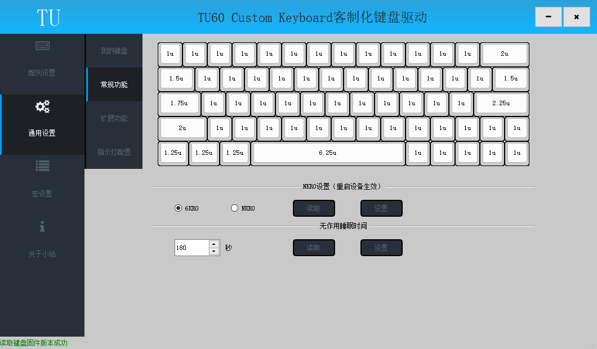
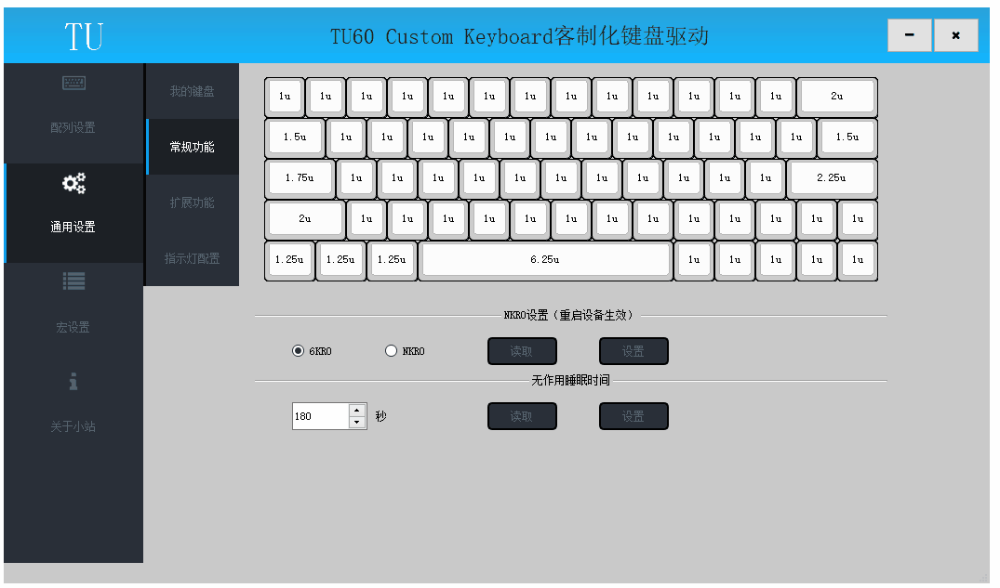
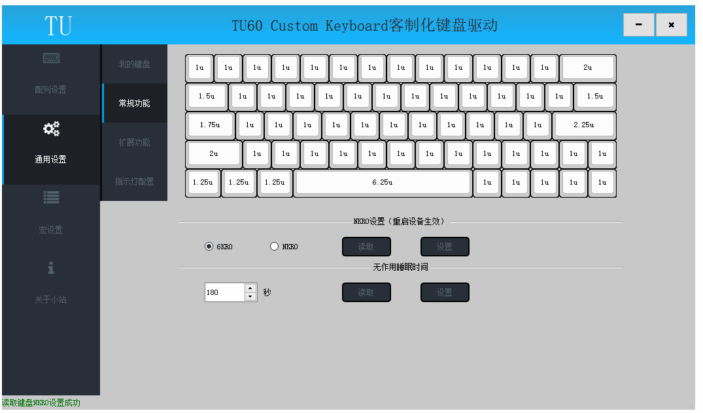

# 全键无冲

此节内容相关操作均在驱动的通用设置—>常规功能页面

## 无冲模式

	6KRO:受限于USB HID协议，最多支持按下6个按键和4个模式键（Ctrl\Win\Alt\Shift);
	NRKO:使用非标准USB HID协议，可以输出全部按下按键,此模式在部分BIOS下不兼容;

## 读取无冲模式

点击NKRO设置下的"读取"按钮可以查询当前键盘无冲模式；
读取成功后状态栏弹出读取成功提示；

## 设置无冲模式

选择6KRO或者NKRO，点击"设置"按钮设置键盘无冲模式；
设置成功后状态栏弹出设置成功提示；

设置键盘无冲模式需要重启键盘才能生效；

	【有线键盘】重新插拔USB线实现重启
	【无线键盘】关闭主板开关再开启开关实现重启

