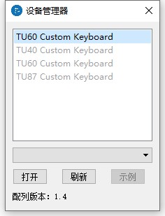
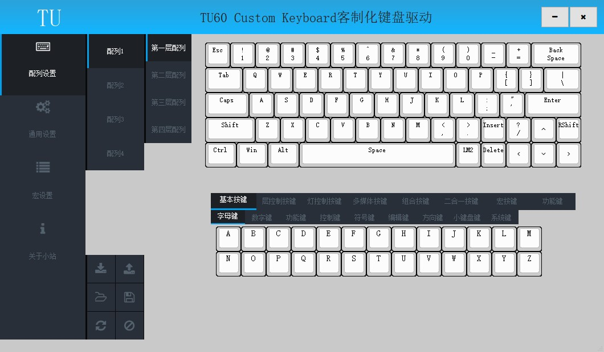
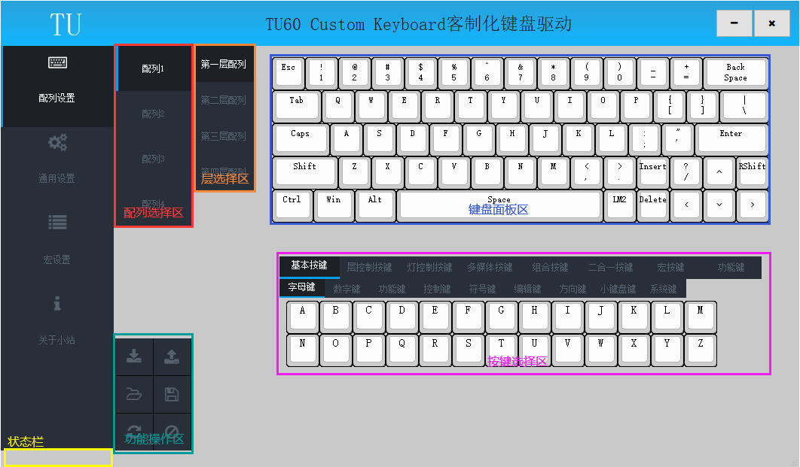
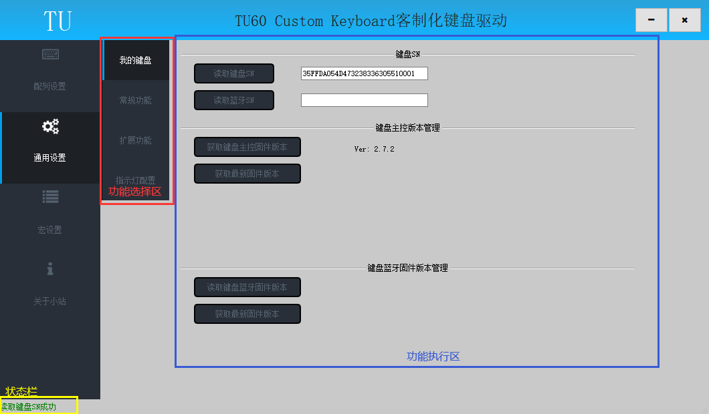
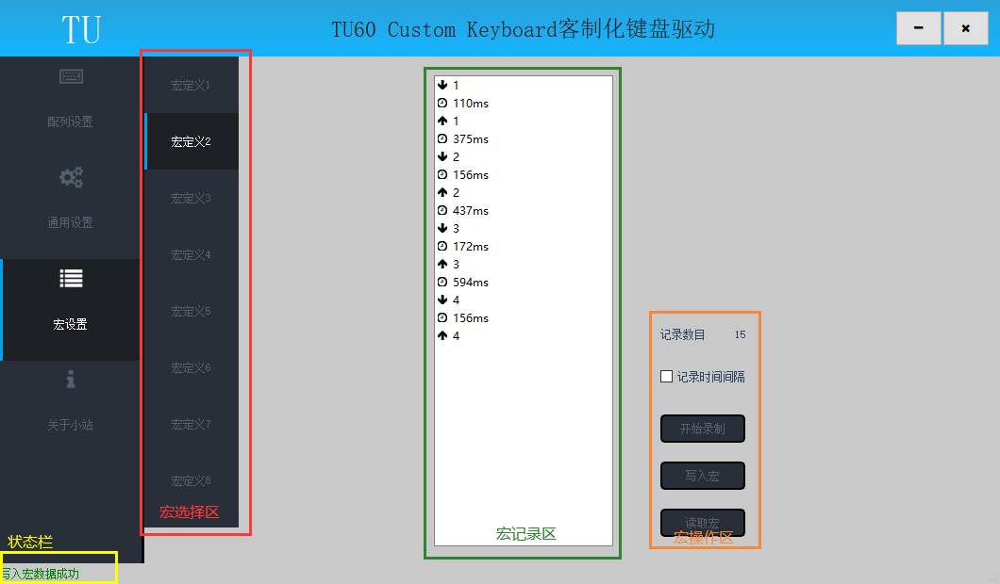

# 初识驱动

## 驱动下载

[【TU驱动程序V2.6.8】](https://tuusermanual.oss-cn-beijing.aliyuncs.com/Driver/TuKeyboardDriverSetup_2_6_8.exe)

下载完成后双击安装即可；

## 设备管理器

双击打开驱动后开启的界面为设备管理器界面；
设备管理器用于选择要操作的键盘设备；
	
	黑色项目为检测到的实例设备，选择设备后点击“打开”按钮进入驱动；
	灰色项目为驱动内置的虚拟设备，选择设备后可以选择相应配列，点击“示例”按钮进入驱动；
	刷新按钮用于重新检测实例设备，并同步服务器上的最新配列文件；

## 驱动主界面

	【配列设置】
		主要用于读取和设置键盘的配列，键盘内置4套配列，每套配列4层;		
		将配列保存为文件，便于互相分享;
		设置组合按键、二合一按键和宏按键;
	【通用设置】
		查看主控SN、主控固件版本、蓝牙固件版本;
		设置键盘全键无冲或6键无冲;
		设置键盘指示灯;		
		设置无线版本无动作睡眠时间(仅适用于选配无线模块版本);
		2.4G版本重新配对(仅适用于选配无线模块版本);
		键盘无线功能增配(仅适用于选配无线模块版本);
	【宏设置】
		设置宏按键,最多可设置32个宏按键,每个宏最大支持120个动作;
	【关于小站】
		驱动版本查询;
		店铺产品推广;

#### 配列设置子

上图为配列设置子界面，分为配列选择区、层选择区、键盘面板区、按键选择区、功能操作区、状态栏六部分；具体操作后面章节将详细讲述；

|区域名称|区域功能|
| ------ | ------ |
| 配列选择区 | 用于选择待操作的配列，当前选中的配列左侧有蓝色竖线标识 |
| 层选择区 | 用于选择待操作的层，当前选中的层左侧有蓝色竖线标识 |
| 键盘面板区 | 用于选择待操作的按键，当前选中的按键有红色框线 |
| 按键选择区 | 用于选择修改当前选中按键为何按键 |
| 功能操作区 | 用于执行写入配列、读取配列、保存配列、加载配列、设为空白、恢复默认操作 |
| 状态栏 | 用于显示操作状态，绿色表示成功，黄色表示警告，红色表示错误 |

#### 通用设置子界面

上图为配列设置子界面，分为功能选择区、功能执行区、状态栏三部分；

|区域名称|区域功能|
| ------ | ------ |
| 功能选择区 |  |
| 功能执行区 |  |
| 状态栏 | 用于显示操作状态，绿色表示成功，黄色表示警告，红色表示错误 |

#### 宏设置子界面

上图为宏设置子界面，分为宏选择区、宏记录区、宏操作区、状态栏四部分；

|区域名称|区域功能|
| ------ | ------ |
| 宏选择区 | 用于选择待操作的宏，当前选中的配列左侧有蓝色竖线标识，共32个宏可选 |
| 宏记录区 | 用于显示当前宏的操作，最多支持120个宏动作，按键按下、释放及延时均定义为1个动作 |
| 宏操作区 | 用于显示记录数目及执行记录宏、写入宏、读取宏操作 |
| 状态栏 | 用于显示操作状态，绿色表示成功，黄色表示警告，红色表示错误 |

