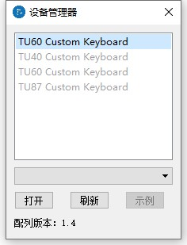

# 初识驱动

## 驱动下载

[【TU驱动程序V2.6.8】](https://tuusermanual.oss-cn-beijing.aliyuncs.com/Driver/TuKeyboardDriverSetup_2_6_8.exe)

下载完成后双击安装即可；

## 设备管理器

双击打开驱动后开启的界面为设备管理器界面；
设备管理器用于选择要操作的键盘设备；
	
	黑色项目为检测到的实例设备，选择设备后点击“打开”按钮进入驱动；
	灰色项目为驱动内置的虚拟设备，选择设备后可以选择相应配列，点击“示例”按钮进入驱动；
	刷新按钮用于重新检测实例设备，并同步服务器上的最新配列文件；

## 驱动主界面

	【配列设置】
		主要用于读取和设置键盘的配列，键盘内置4套配列，每套配列4层;		
		将配列保存为文件，便于互相分享;
		设置组合按键、二合一按键和宏按键;
	【通用设置】
		查看主控SN、主控固件版本、蓝牙固件版本;
		设置键盘全键无冲或6键无冲;
		设置键盘指示灯;		
		设置无线版本无动作睡眠时间(仅适用于选配无线模块版本);
		2.4G版本重新配对(仅适用于选配无线模块版本);
		键盘无线功能增配(仅适用于选配无线模块版本);
	【宏设置】
		设置宏按键,最多可设置32个宏按键,每个宏最大支持120个动作;
	【关于小站】
		驱动版本查询;
		店铺产品推广;

