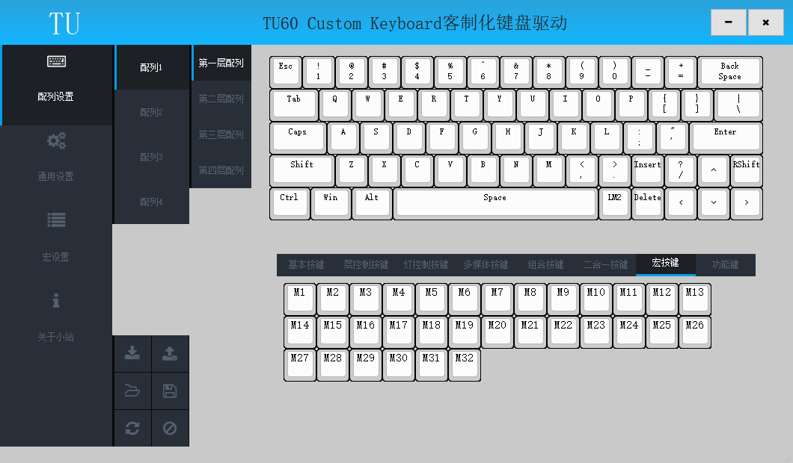
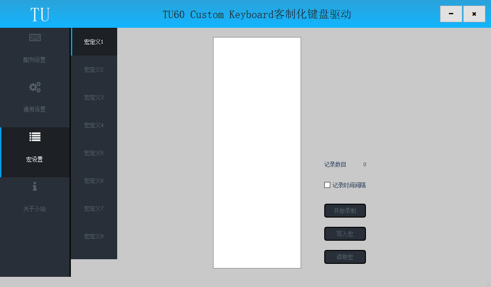
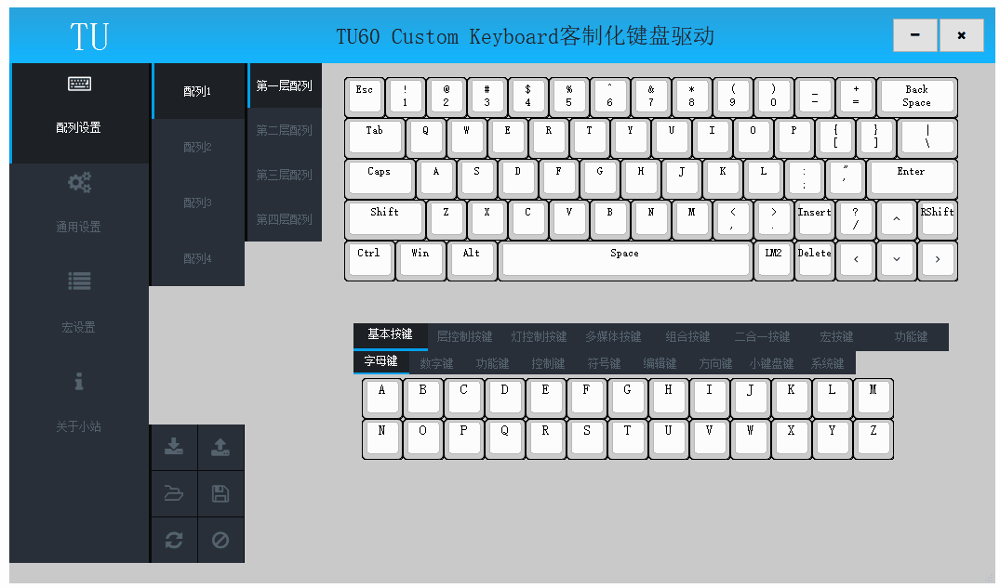

# 宏键

此节内容相关操作在驱动的配列设置页面和宏设置页面；

## 含义

宏键可以实现一个按键输出预设的一系列按键操作，提高输入效率；

例如

	将某个按键设置为宏键M2;
	将宏键M2对应的宏定义2写入预设的按键操作序列"1234";
	触发该按键将输出1234
	输出1234可以连续输出，也可以模仿录入的间隔输出;

## 宏性能

	键盘最大可以存储32个宏定义;
	每个宏定义最大支持120个动作;
	宏定义动作分为三种,按下、释放和延时;

## 设置宏键

 	1、设置按键为宏键
		在键盘面板上点击待设置按键，按键框线变为红色指示当前配置按键;
		在按键选择区域点击设置的宏键，键盘面板上当前按键显示为宏键;
		写入配列,完成宏键的设置;

	2、写入宏定义
		宏键M1-M32分别对应宏定义1到宏定义32;
		切换到宏设置页面,选择对应的宏定义;
		如果需要记录按键时间间隔,勾选记录时间间隔;
		点击“开始录制”按钮,在键盘上输入预设的按键操作序列;
		录制完成后,点击“停止录制”按钮,完成宏定义的录制;
		点击“写入宏”按钮,将录制的按键操作序列写入键盘,完成宏定义写入;

	

