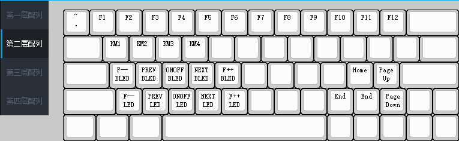

# 配列和层

## 配列（Keymap)
键盘的各个按键输出不同的键值，配列是对全部按键输出键值的整体描述；
客制化键盘相较于量产键盘的最大优势就是可以自定义每个按键的键值，用户可以按照自己的喜好自定义每个按键，最终形成的整体键值称为配列；
下图为最常用的qwerty配列。

下图为dvorak配列，相比于qwerty配列，将高频键分布在中排，降低手指移动距离，均衡左右手负担。

## 层（Layer）

对于非全尺寸键盘（特别是40%和60%），需要用更少的按键去实现全部按键的功能；客制化键盘引入层的概念，便将全部按键分多层放置，同时设立层切换按键，这样便可实现全部按键的输出；

下图为60%的第一层按键

下图为60%的第二层按键

将常用的60个按键放置在第一层，将不常用的按键（如F1-F12）放在第二层，同时在第一层设置一个按键（LM2）用于切换到第二层，这样如果需要输出第一层按键（如数字1）直接单击即可，需要输出第二层按键（如功能F1），需要使用LM2和按键组合操作输出；

## 控制按键

在TU客制化键盘驱动软件中，配列和层的设置页面如下图；

	红色框线部分用于选择操作的配列和层
		单击配列1-配列4切换操作的配列
		单击第一层配列-第四层配列切换操作的层
	
	蓝色框线部分用于设置配列切换键和层切换按键
		KM1-KM4按键用于配列切换
		LM2-LM4按键用于瞬间开启层
		LT2-LT4按键用于开关层

## 配列切换

	TU客制化系列键盘可存储4个配列;
	单击下图中的KM1-KM4即可切换到相应配列;
	设置配列时应注意再每个配列中均要设置切换到其他配列的按键，否则会存在从配列A切换到配列B后无法切换回配列A的问题。

## 层切换
	TU客制化键盘每个配列可存储4层按键；
	层1为最底层，层4为最高层，初始情况为层1开启，层2-层4关闭；
	按下某个按键后，会输出最高开启层该按键位置对应的键值，如当前层未设置按键，将输出次高开启层该位置对应的按键；直到查找到层一，若层一也未设置按键，则无输出；
	LM2-LM4为瞬时开启层按键，分别对应层2到层4，按键按下，相应层开启；按键释放，相应层关闭；
	LT2-LT4为层开关，分别对应层2到层4，按键单击一次，层的状态进行改变；若层为开启状态，将变为关闭；若层为关闭状态，将变为开启；
	使用LT时请注意LT对应位置的其他层不要有其他键值定义，应设置为空白，否则再单击LT时输出的为其他按键，无法触发LT实现关闭层的功能；

#### 层切换示例1

	该示例用于演示层的输出逻辑；
	下图分别为层1-层3的按键设置；
	层1中有两个层切换按键，LM2和LM3，为瞬时开启按键；
	若按下LM2,再按数字1处的位置按键，此时最高开启层为层2，且按键非空白，输出层2的功能键F1;
	若按下LM2,再按数字2处的位置按键，此时最高开启层为层2，且按键非空白，输出层2功能键F2;
	若按下LM3,再按数字1处的位置按键，此时最高开启层为层3，但由于层3该按键为空白键，次高开启层为层1，输出层1数字键1;
	若按下LM3,再按数字2处的位置按键，此时最高开启层为层3，且按键非空白，输出层3的字母键T;

#### 层切换示例2

	该示例用于演示层切换按键LM和LT的区别；
	下图分别为层1-层2的按键设置；
	层1中有两个层切换按键，LM2和LT2；
	若使用LM2输出层2的功能键F1，需要按下LM2，然后单击数字1处的按键，再释放LM2;
	若使用LT2输出层2的功能键F2, 需要单击LT2,然后单击数字1处的按键，再单击LT2;

