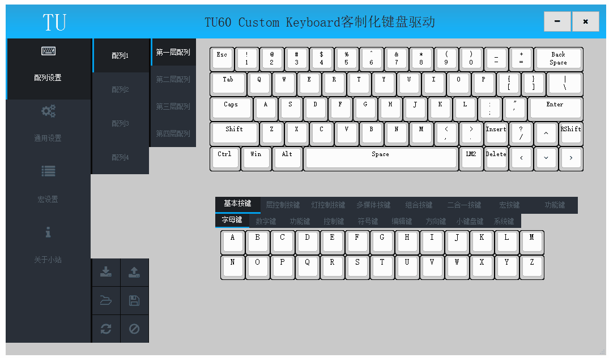

# 2.4G

本章节内容仅适用于2.4G无线版本键盘；

除特殊说明外，本章节所有的操作均需拔除键盘USB线，如果未拔除，键盘将处于有线工作模式，2.4G模块未启用；

## 2.4G配对

TU客制化套件出厂已经与USB适配器配对完成，用户无须再次配对，如果有配对需求，可按照以下步骤进行配对；

##### 2.4G配对方法1【需要移除电池】

1、拔掉键盘数据线，移除键盘电池，移除USB适配器，保持主板开关开启

2、插入键盘数据线，打开驱动软件，点击通用设置->扩展功能页面中2.4G模块权限管理下的清除配对，状态栏弹出清除2.4G模块配对成功提示；

3、拔掉键盘数据线，将USB适配器插入电脑，安装电池，点击键盘任意按键直到电脑显示有按键触发，完成配对。

##### 2.4G配对方法2【无须移除电池】

1、拔掉键盘数据线，移除USB适配器，保持主板开关开启，无须移除电池；

2、插入键盘数据线，打开驱动软件，点击通用设置->扩展功能页面中2.4G模块权限管理下的清除配对，状态栏弹出清除2.4G模块配对成功提示；

3、拔掉键盘数据线，关闭主板开关，将USB适配器插入电脑，开启主板开关，点击键盘任意按键直到电脑显示有按键触发，完成配对。

