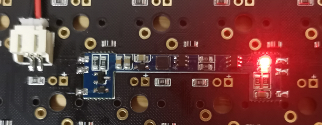
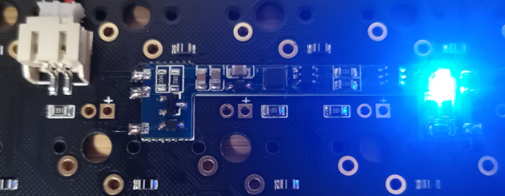

# 电池

## 选购

TU客制化键盘预留PH2.0接头，反向公插接头，要求电池内置充放电保护板，电池尺寸根据具体外壳选择；

如果选择使用店铺套件外壳，推荐购买电池如下：

[【40套件推荐电池（3.7V/PH2.0反向插）】](https://item.taobao.com/item.htm?spm=a1z10.5-c-s.w4002-14690471761.45.7553549e1pvuiP&id=520119850061)

[【60套件推荐电池（3.7V/PH2.0反向插）】](https://item.taobao.com/item.htm?spm=a1z09.2.0.0.72582e8dlxnqbN&id=562777053485&_u=mk4etmo626f)

## 充电

TU客制化键盘主板搭载充电板，位于电池座旁边；

充电板上有红色、蓝色两颗指示灯用于指示充电状态；

红色蓝色灯均亮，表示未检测到电池；

红色灯亮，表示电池正在充电；

蓝色灯亮，表示电池充电完成；

