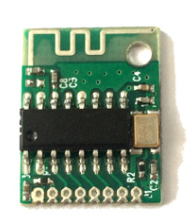
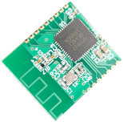
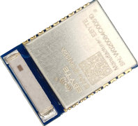
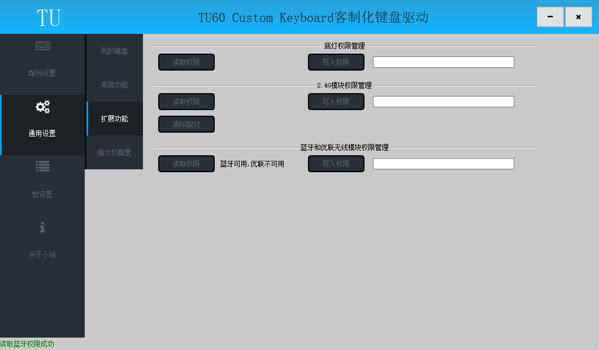

# 类别

TU客制化有线套件可以通过增配无线模块的方式实现双模或三模，无线模块有2.4G、蓝牙、优联可选，满足客户多样化需求。

## 无线对比

|无线方案| 2.4G | 蓝牙 | 蓝牙&优联 |
| ------ | ------ | ------ | ------ |
| 支持设备数量 | 1个 | 3个 | 3个蓝牙+1个优联 |
| 支持设备类型 | PC | PC、PAD、PHONE                                               | PC、PAD、PHONE |
| USB适配器 | 套件包含1个 | 不需要，但需要PC具有蓝牙4.0及以上适配器                      | 使用蓝牙需要PC具有蓝牙4.0及以上适配器 使用优联客户自备优联适配器（C-U0007或C-U0012） |
| 回连速度 | 0.5s以内 | 10s以内 | 蓝牙10s以内，优0.5s以内 |
| 选购建议 | 1、无平板、手机连接需求 2、PC USB接口充足 | 1、有平板、手机连接需求 2、PC USB接口不充足 3、PC具有蓝牙4.0及以上适配器 | 1、有平板、手机连接需求 2、同时使用支持优联的鼠标 |

## 类别区分

#### 硬件区分
无线模块出厂已经安装在主板上，具体型号见下表；

|无线模块| 模块型号 | 无线类别 | 说明 |
| ------ | ------ | ------ | ------ |
|  | KL01 | 2.4G |  |
|  | BM02 | 蓝牙或蓝牙&优联 | 使用驱动进一步区分 |
|  | BT50 | 蓝牙或蓝牙&优联 | 使用驱动进一步区分 |

#### 驱动区分

打开驱动软件中通用设置->扩展功能界面；

点击2.4G模块权限管理区域的读取权限按钮，若显示为“可用”则无线类别为2.4G；

点击蓝牙和优联无线模块权限管理区域的读取权限按钮；
若显示为“蓝牙可用，优联不可用”则无线类别为蓝牙；

若显示为“蓝牙可用，优联可用”则无线类别为蓝牙&优联；

