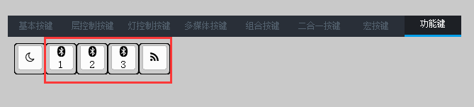
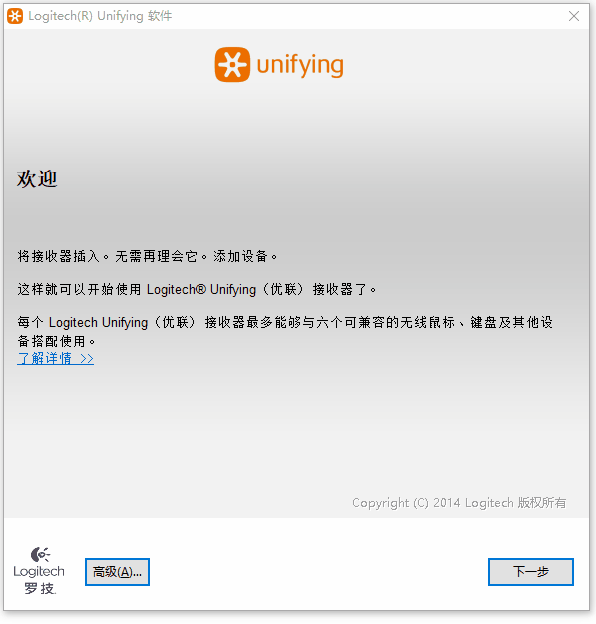

# 蓝牙&优联

本章节内容适用于蓝牙&优联版本无线键盘；

除特殊说明外，本章节所有的操作均需拔除键盘USB线，如果未拔除，键盘将处于有线工作模式，蓝牙&优联模块未启用；

## 主机从机

根据标准蓝牙协议，键盘为从机，下称键盘或从机设备；PC、手机及平板等设备为主机，下称主机或主机设备；

## 指示灯

TU客制化键盘蓝牙&优联模块位于主板背面，在蓝牙&优联模块旁边有一红一蓝两个指示灯，红色指示灯用于指示当前蓝牙状态，蓝色指示灯用于指示当前优联状态；

| 指示灯状态 | 蓝牙&优联状态 | 状态含义 |
| --------  | ---------- | ------- |
| 红色慢闪 | 蓝牙广播状态 | 键盘蓝牙可以被其他主机设备搜索，并等待主机连接； |
| 红色快闪 | 蓝牙回连状态 | 尝试与最后一次配对的蓝牙主机设备连接，无法被其他主机连接； |
| 红色亮5秒后熄灭 | 蓝牙工作状态 | 已经与主机配对且连接成功，进入工作状态；|
| 蓝色慢闪 | 优联广播状态 | 键盘优联在此状态下可以与优联适配器配对； |
| 蓝色快闪 | 优联回连状态 | 尝试与最后一次配对的优联适配器连接; |
| 蓝色亮5秒后熄灭 | 优联工作状态 | 已经与优联适配器连接成功，进入工作状态； |
| 蓝色常亮 | 升级状态 | 键盘处于升级状态，具体见[蓝牙升级](../升级/蓝牙升级.md)章节 |

## 状态切换

若键盘处于广播状态180秒未收到连接请求或未与优联适配器配对成功，将自动进入睡眠状态；

若键盘处于回连状态30秒未成功连接主机或优联适配器，将自动进入睡眠状态；

处于睡眠状态的设备，按最左上按键(默认配列ESC按键)可以退出睡眠状态，键盘将根据上次配对信息自动选择进入广播状态或回连状态；
## 设备切换

TU客制化键盘蓝牙版本可以存储3个蓝牙主机设备信息和1个优联适配器信息，可以在3个蓝牙主机设备和1个优联设备间进行切换；
驱动软件中提供4个按键用于切换蓝牙主机设备和优联适配器，分别对应蓝牙主机设备1-3和优联适配器，如下图：

单击蓝牙切换按键可以切换到蓝牙主机设备，若当前通道未绑定蓝牙主机设备，将自动进入蓝牙广播状态；若当前通道已绑定蓝牙主机设备，将自动进入蓝牙回连状态；

单击优联切换按键可以切换到优联主机设备，若此前未与优联适配器配对，将自动进入优联广播状态；若当前通道已与优联适配器配对，将自动进入优联回连状态；

## 蓝牙配对新设备

长按5秒以上蓝牙切换按键直至红灯慢闪，可以强制使键盘相应通道进入广播状态，在主机设备发起连接即可实现配对新设备操作；

若主机设备端以前连接过键盘且保留键盘配对信息，但键盘端由于连接其他设备删除了该主机设备信息，进行配对操作会提示设备连接不成功，需要在主机设备端删除该键盘配对信息后重新连接；

## 优联配对

[【优联WIN配对工具】](https://tuusermanual.oss-cn-beijing.aliyuncs.com/Tool/unifying250.exe)

[【优联MAC配对工具】](https://tuusermanual.oss-cn-beijing.aliyuncs.com/Tool/._Unifying%20Installer.app)

下载优联配对工具并安装；

长按优联切换键5秒以上，观察指示灯，直至设备进入优联广播状态；

打开优联配对工具，并插入优联适配器；点击高级按钮；

选中Unifying接收器，点击右侧配对新设备按钮，将自动完成优联设备配对；

如果配对失败，检查键盘是否由于广播超时进入睡眠状态；

