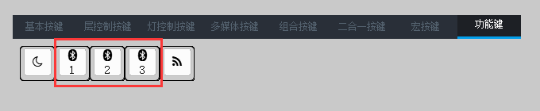

# 蓝牙&优联

本章节内容适用于蓝牙&优联版本无线键盘；

除特殊说明外，本章节所有的操作均需拔除键盘USB线，如果未拔除，键盘将处于有线工作模式，蓝牙&优联模块未启用；

## 主机从机

根据标准蓝牙协议，键盘为从机，下称键盘或从机设备；PC、手机及平板等设备为主机，下称主机或主机设备；
## 指示灯
TU客制化键盘蓝牙&优联模块位于主板背面，在蓝牙&优联模块旁边有一红一蓝两个指示灯，红色指示灯用于指示当前蓝牙状态，蓝色指示灯用于指示当前优联状态；

| 指示灯状态 | 蓝牙&优联状态 | 状态含义 |
| --------  | ---------- | ------- |
| 红色慢闪 | 蓝牙广播状态 | 键盘蓝牙可以被其他主机设备搜索，并等待主机连接；|
| 红色快闪 | 蓝牙回连状态 | 尝试与最后一次配对的蓝牙主机设备连接，无法被其他主机连接； |
| 红色亮5秒后熄灭 | 蓝牙工作状态 | 已经与主机配对且连接成功，进入工作状态；|
| 蓝色慢闪 | 优联广播状态 |  |
| 蓝色快闪 | 优联回连状态 |  |
| 蓝色亮5秒后熄灭 | 优联工作状态 | 已经与优联适配器连接成功，进入工作状态； |
|  |  |  |
|  |  |  |
| 蓝色常亮 | 升级状态 | 键盘处于升级状态，具体见[蓝牙升级](../升级/蓝牙升级.md)章节 |

## 状态切换

若键盘处于广播状态180秒未收到连接请求，将自动进入睡眠状态；

若键盘处于回连状态30秒未成功连接主机，将自动进入睡眠状态；

处于睡眠状态的设备，按最左上按键(默认配列ESC按键)可以退出睡眠状态，键盘将根据上次配对信息自动选择进入广播状态或回连状态；
## 设备切换

TU客制化键盘蓝牙版本可以存储3个主机设备信息，可以在3个主机设备间进行切换；
驱动软件中提供3个按键用于切换主机设备，分别对应主机设备1-3，如下图：

单击蓝牙切换按键可以实现蓝牙主机设备的切换，若当前通道未绑定蓝牙主机设备，将自动进入广播状态；若当前通道已绑定蓝牙主机设备，将自动进入回连状态；
