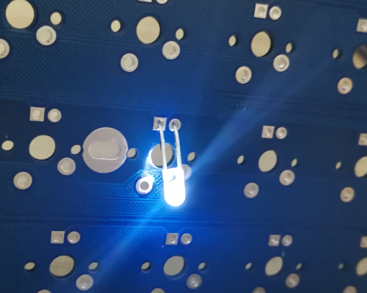

# 主板测试

## 准备硬件

	1、待测试主板
	2、两把镊子或两段焊锡丝，镊子需要选择导电性良好的镊子
	3、Led

## 下载软件

[【TU驱动程序V2.7.0】](https://tuusermanual.oss-cn-beijing.aliyuncs.com/Driver/TuKeyboardDriverSetup_2_7_0.exe)

[【KeyboardTest.exe】](https://tuusermanual.oss-cn-beijing.aliyuncs.com/Tool/keyboardtest.exe)

## 按键测试

安装驱动软件，使用USB线连接主板和电脑，查看键盘的默认配列；驱动软件使用参考[配列操作](../使用/配列操作.md)章节；

打开KeyboardTest软件，该软件中未触发的按键无网格线覆盖，正在触发的按键有红色网格线覆盖，触发过的按键有绿色网格线覆盖；

使用镊子依次短接PCB上每个键位的两个轴孔，检查相应的按键是否正常触发；

## 特殊按键
Print Screen按键不会显示在KeyboardTest软件中，触发该按键后，打开系统画图软件，使用其它键盘输入粘贴指令（Ctrl + V)，刚才的屏幕截图显示在画图软件中，证明Print Screen按键正常；

配列中的层切换按键（如LM2、LM3）不会显示在KeyboardTest软件中，可以使用组合按键测试；如TU60的默认组合键LM2+1输出F2，可以使用一把镊子一直短接LM2，另一把镊子短接1，如果F2触发，证明LM2按键正常；层切换按键的使用参考[配列和层](../使用/配列和层.md)章节；

## 灯孔测试

Led灯的长脚为正极，短脚为负极；待测试主板方孔位正极，圆孔为负极；

发货的主板默认灯效为呼吸模式，灯效切换参考[背光灯](../使用/背光灯.md)章节；

将LED按照正负极依次插入每个灯孔，插入后保持LED灯脚与主板灯孔焊盘充分接触，LED能够呼吸（亮灭渐变）证明主板灯孔正常；

