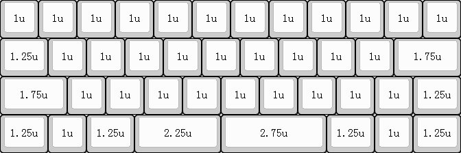
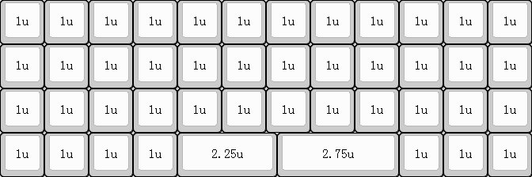
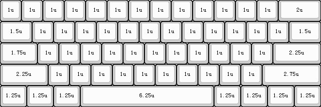
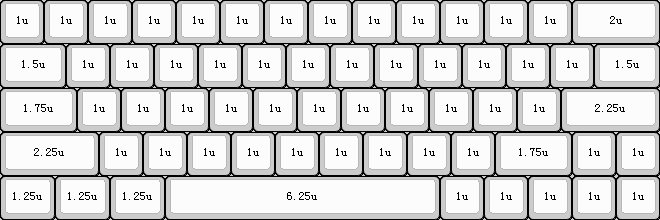
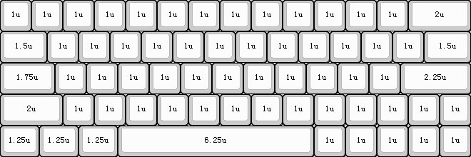
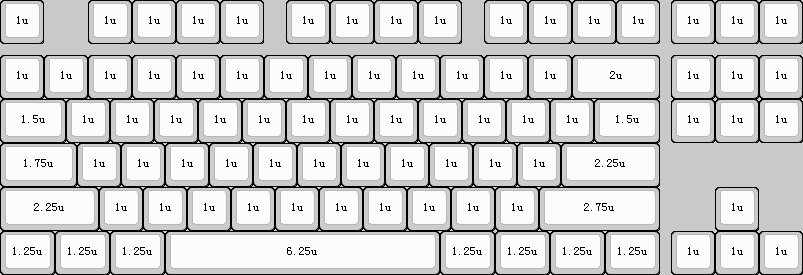
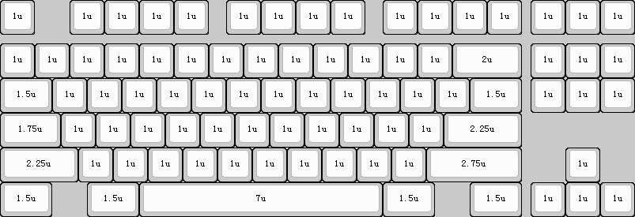
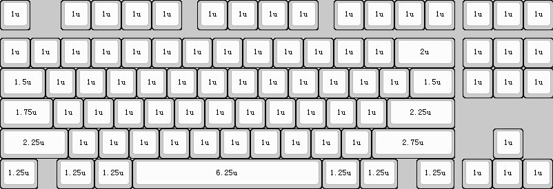

## 布局

- 根据自身偏好选择合适的布局；
- 40%布局分为常规布局（42键）和普朗克布局（45键）；
- 60%布局分为Poker布局（61键）、64非左移布局（63键）和64左移布局（64键）；
- 80%布局分为无门牙布局（87键）、大门牙布局（84键）和小门牙布局（86键）；
- 60%及以下布局需要使用组合键输出部分按键；

#### 40常规布局

#### 40普朗克配列

#### 60Poker配列

#### 64非左移配列

#### 64左移配列

#### 87无门牙配列

#### 87大门牙配列

#### 87小门牙配列

